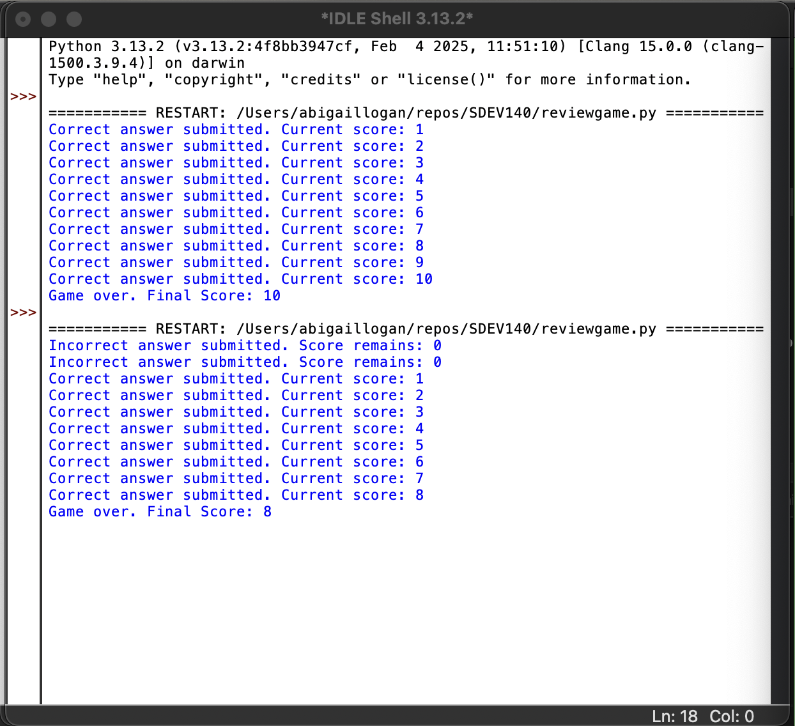
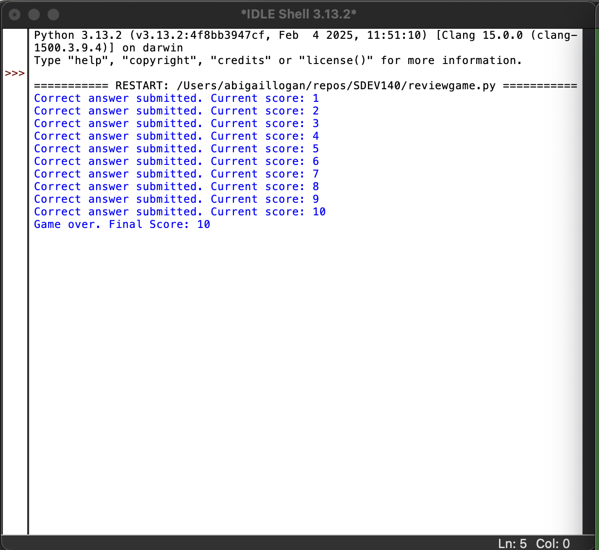
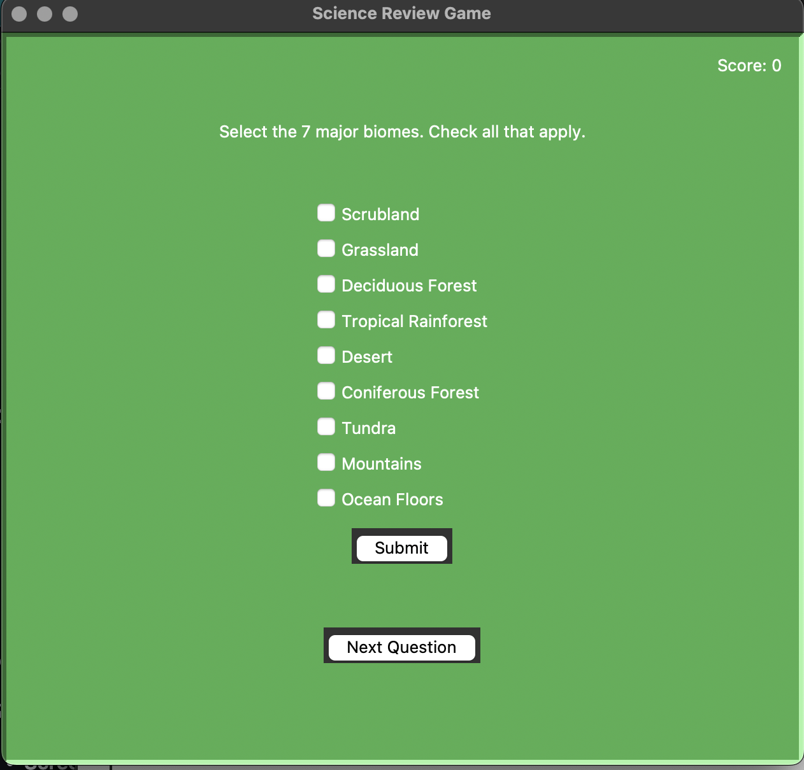

# Project Title: **Review Game**  
*An interactive Python Tkinter application built with `breezypythongui`*

---

## Table of Contents  
1. [Introduction](#introduction)  
2. [Validation Testing](#validation-testing)  
   1. [Test Data Sets](#test-data-sets)  
   2. [Explanation of Test Results](#explanation-of-test-results)  
   3. [Screenshots](#screenshots)  
3. [User Manual](#user-manual)  
4. [Source Code Documentation](#source-code-documentation)  
5. [GitHub Repository Link](#github-repository-link)  

---

## Introduction  
This program, **Review Game**, is a Python application designed to create an interactive quiz or review session for end users. The GUI utilizes both `tkinter` and `breezypythongui` as its parent framework, enabling an intuitive, user-friendly interface. Players can select questions, provide answers, and see real-time feedback.

---

## Validation Testing  
Validation testing ensures that the application behaves correctly for a variety of input scenarios.

### Test Data Sets  
1. **Valid Test Data:**  
   - **Input:** All fields filled with expected formats (e.g., standard text questions, single-choice answers).  
   - **Expected Result:** The program should display the question, accept the answer, and show correct/incorrect feedback without errors.
<div align=center>

</div>


2. **Boundary Cases:**  
   - **Input:** Empty answer fields, extremely long text inputs, or special characters.  
   - **Expected Result:** The program either prompts the user to correct their input (if needed) or handles it gracefully.
<div align=center>

</div>

3. **Invalid/Edge Cases:**  
   - **Input:** Non-text data where text is expected, or invalid question data.  
   - **Expected Result:** The program should not crash; it should display an appropriate message or ignore the invalid data.

### Explanation of Test Results  
- During testing, it was found that **invalid input** handling needed improvement. Specifically:  
  1. **Empty Answers:** The application needed an additional check to guide the user if they provided no input.  
  2. **Out-of-Range Selections:** If a user attempted to select a question not in the list, the program now correctly warns them to pick an existing question.  
- After implementing the necessary checks and error handling, all test cases executed successfully.

### Screenshots  
*(Space savers for screenshots; replace with actual images in your repository)*
<div align=center>

</div>

- **Screenshot 1: Valid Test Data Working**  
- **Screenshot 2: Handling Boundary Cases**
- **Screenshot 3: Handling Invalid Input**


---

## User Manual  
Below is a brief guide to help new users get started:

1. **Launching the Application:**  
 - Open the command line or terminal.  
 - Navigate to the folder containing `reviewgame.py`.  
 - Run:  
   ```bash
   python reviewgame.py
   ```
2. **User Interface Overview:**  
 - **Question Selection:** Choose from the list or enter the question number.  
 - **Answer Entry:** Type in your answer and submit.  
 - **Feedback Display:** The application will inform you if your answer is correct or incorrect.  

3. **Program Workflow:**  
 1. Launch the program.  
 2. Enter/Select a question.  
 3. Input your answer in the text field.  
 4. Click the "Submit" button.  
 5. Review the feedback message.  
 6. Repeat for other questions.  

4. **Common Troubleshooting:**  
 - **No questions showing up?** Ensure you have the correct data or question set loaded.  
 - **Application not responding?** Close and reopen the program; verify that Python, `tkinter`, and `breezypythongui` are installed.

---

## Source Code Documentation  
The source code in `reviewgame.py` is fully documented with in-line comments that describe variable usage, function purpose, and logic flow.

1. **Module Headers**  
 - Each function (`def`) or class in the program has a header comment describing its purpose.  
2. **Variable Explanations**  
 - Variables are annotated with end-line comments describing their role (e.g., `score = 0  # keeps track of player's correct answers`).  
3. **Inline Comments**  
 - Throughout the code, essential lines/sections include comments explaining what is being done.

**Example snippet** showing how `breezypythongui` is used as the parent class:

---

## GitHub Repository Link

You can find the complete project, including this README, source code, test data, and screenshots, in the following GitHub repository:
[Review Game Repository](https://github.com/alo77/SDEV140)
