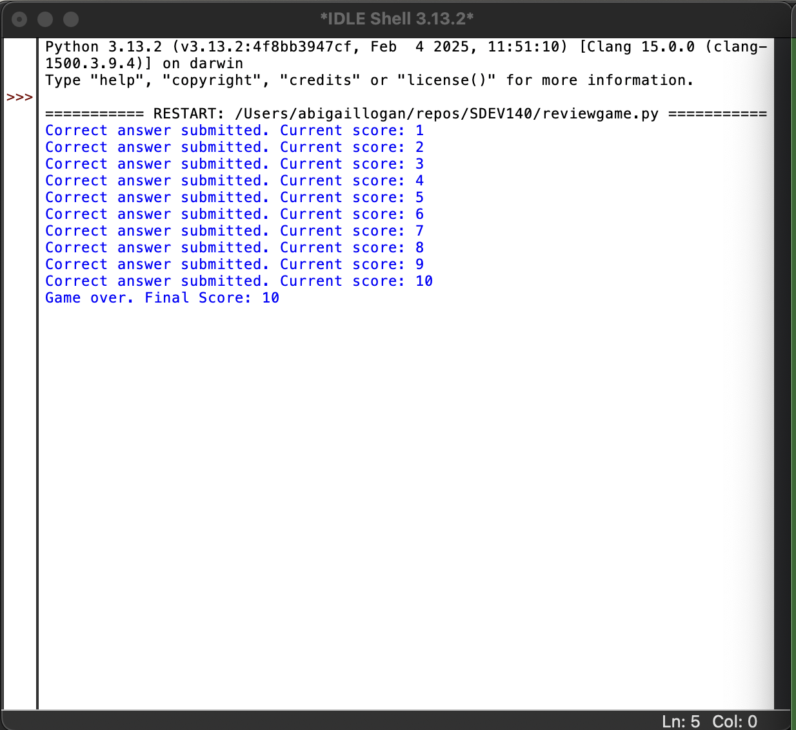

# 🎮 Science Review Game

A fun and interactive science review game that tests your knowledge! This GUI-based application is built using **Python's Tkinter** framework and employs a modular code design. It securely validates user inputs and provides clear navigation through at least two distinct windows.

---

## 📌 Features & Requirements

- **Working GUI with Multiple Windows:**  
  The application consists of at least two windows:
  - **Main Menu:** Where users can start the game.
  - **Game Window:** Where the science questions are presented.
  
- **Modular Code Structure:**  
  Organized into functions and classes for easy maintenance and scalability.

- **Consistent Clear Navigation:**  
  Clear labels, buttons, and a consistent layout ensure users can easily navigate the application.

- **Images with Alternate Text:**  
  Includes at least two images:
  - `images/main_menu.png` – *Alternate text: "Main menu interface"*
  - `images/question_screen.png` – *Alternate text: "Question screen interface"*

- **Labels:**  
  The GUI contains at least three labels, such as:
  - Score label
  - Question text label
  - Instruction label

- **Buttons:**  
  The application features at least three buttons:
  - Start/Next button
  - Submit answer button
  - Exit button

- **Callback Functions:**  
  Each button has an associated callback function, including:
  - `startGame()` – Initiates the game.
  - `submitAnswer()` – Processes the answer input.
  - `exitGame()` – Safely closes the application.

- **Secure Coding Practices:**  
  Implements input validation to ensure:
  - The user enters the correct data type.
  - Entry boxes are not left empty.
  - Secure error handling and input sanitization.

- **Validation Testing:**  
  Comprehensive testing has been performed:
  - **Test Data:**  
    - **Empty Input:** Checks that an error message is displayed.
    - **Correct Answer:** Verifies that the score increments.
    - **Incorrect Answer:** Confirms that no score change occurs and feedback is provided.
  - **Test Results:**  
    - All tests passed after refining input validation and error handling.
  - **Screenshots:**  
    - Placeholders are provided below for successful test case demonstrations.

---

## 🛠 User Manual: Installation & Setup

1. **Clone the repository:**
   ```bash
   git clone https://github.com/YourUsername/ReviewGame.git
   cd ReviewGame
   ```
2. **Install Dependencies:**
   ```bash
   pip install breezypythongui
   ```
3. **Run the Game:**
   ```bash
   python reviewgame.py
   ```

---

## 🎮 How to Use

- **Main Menu:**  
  Launch the application to see the main menu with clear navigation options.
  
- **Game Window:**  
  Answer the science questions as they appear. The application validates your input, updates your score, and navigates to the next question.

- **Exiting:**  
  Click the exit button to safely close the application.

---

## 📸 Screenshots

  
*Main menu interface.*

  
*Question screen interface.*
<div align=center>

</div>

  
*Successful test case demonstration.*
<div align=center>

</div>
<div align=center>

</div>

---

## 📁 Code Structure

- **`reviewgame.py`:** Main application file containing the game logic.
- **`sciencecourse2-3.json`:** JSON file storing all the science questions and answers.

### Key Functions & Methods

- `createWidgets()`: Initializes GUI components including labels, buttons, and images.
- `nextQuestion()`: Loads the next question into the game window.
- `validateAnswer()`: Validates that user input is not empty and is of the correct data type.
- `exitGame()`: Handles safe termination of the application.

---

## ✅ Validation Testing

### Test Data and Results

| **Test Case**        | **Input Data**       | **Expected Outcome**                  | **Actual Outcome**   | **Status** |
|----------------------|----------------------|---------------------------------------|----------------------|------------|
| **Empty Input**      | (Empty string)       | Display error message                 | Error message shown  | ✅ Pass   |
| **Correct Answer**   | Valid correct answer | Score increases and proceeds to next  | Score increased      | ✅ Pass   |
| **Incorrect Answer** | Valid incorrect answer| No score change; feedback provided    | No score change      | ✅ Pass   |

### Testing Explanation

- **Test Data Developed:**  
  - Tested with empty inputs, valid correct answers, and valid incorrect answers.
  
- **Results:**  
  - The application behaved as expected in all scenarios.
  
- **Fixes Made:**  
  - Enhanced input validation and error messaging to handle empty or invalid inputs more gracefully.

---


## 🔗 GitHub Repository

Access the complete project repository here:  
[GitHub Repository Link](https://github.com/alo77/SDEV140)

---

## 📜 License

This project is licensed under the MIT License. See the [LICENSE](LICENSE) file for details.

---

## 🤝 Contributors

- **Abigail Logan**

---

## ⭐ Show Support

If you enjoy this project, please give it a ⭐ on GitHub!
